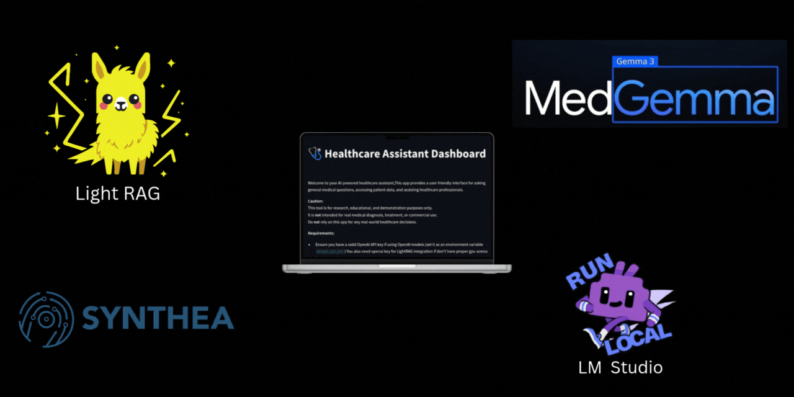
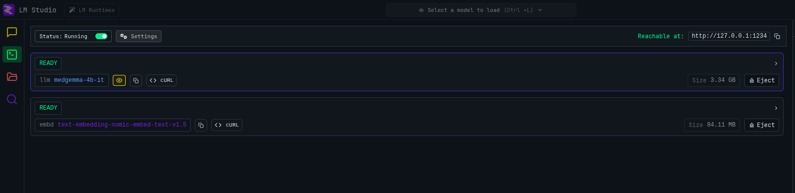
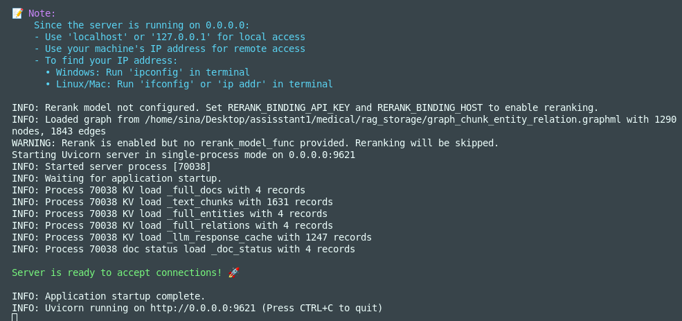

# MedGemma Powered Medical Assistant

This is your AI-powered medical assistant platform designed to help clinicians, nurses, and patients with medical image analysis, clinical data retrieval, and general healthcare support. The system leverages advanced multimodal language models and retrieval-augmented generation (RAG) to provide accurate, context-aware answers and reports.Most features like vlm and general dashboard can run **fully locally on your device** but unfortunately light-rag is depend on openai api due to my hardware,you can also try larger models and rag system on your device if you have the facilities. 

## Features

- **Medical Image Analysis**: Upload radiology, pathology, dermatology, CT, or X-ray images for AI-powered analysis and clinical reporting powered by Medgemma 4b.
- **General Dashboard**: Ask your general medical questions and answered by Medgemma 4b.
- **RAG sytems**: Ask questions about your patients data or any prefered data source and retrieve full accurate answer.


## Setup Instructions

1. **Clone the repository**
2. **Create and activate a Python 3.12+ virtual environment** 
    ```bash
    python venv theenv
    ```
    **you can activate enviroment later by:** `source theenv/bin/activate`
3. **Install dependencies**:
	```bash
	pip install -r requirements.txt
	```
4. **Start LM Studio** and load the `medgemma-4b-it` & `text-embedding-nomic-embed-text-v1.5` model (OpenAI-compatible API at `http://localhost:1234/v1/chat/completions`)
<br>
5. **Enter your openai key in `.env` file.(you only need it for uploading new files to RAG system and retrieve it back.your .env file should look like this:)**<br>
    ```bash
    LLM_BINDING=openai
    LLM_MODEL=gpt-4o-mini
    LLM_BINDING_HOST = 'your provider'
    OPENAI_BASE_URL= 'your provider' 
    OPENAI_API_KEY= 'your api key'
    EMBEDDING_BINDING=openai
    EMBEDDING_BINDING_HOST=http://localhost:1234/v1
    EMBEDDING_MODEL=text-embedding-nomic-embed-text-v1.5
    EMBEDDING_DIM=768
    LMSTUDIO_URL=http://localhost:1234/v1/chat/completions
    LMSTUDIO_MODEL=medgemma-4b-it
    ```
6. **Start Lightrag server in the main Directory:**
    ```bash 
    lightrag-server 
    ```
    <br>
    last lines should look like this and ready to go    
7. open a new Terminal session and **Run the Streamlit app**:
	```bash
	streamlit run main.py
	```


## Data Sources

- CSV files are generated by [synthea](https://synthetichealth.github.io/synthea/) and no real patient's EMR is used.
- sample images are acrossed open-source public datasets

## License

This project is for educational and research purposes only. Not for clinical use.

---

For questions or contributions, please contact the maintainer.